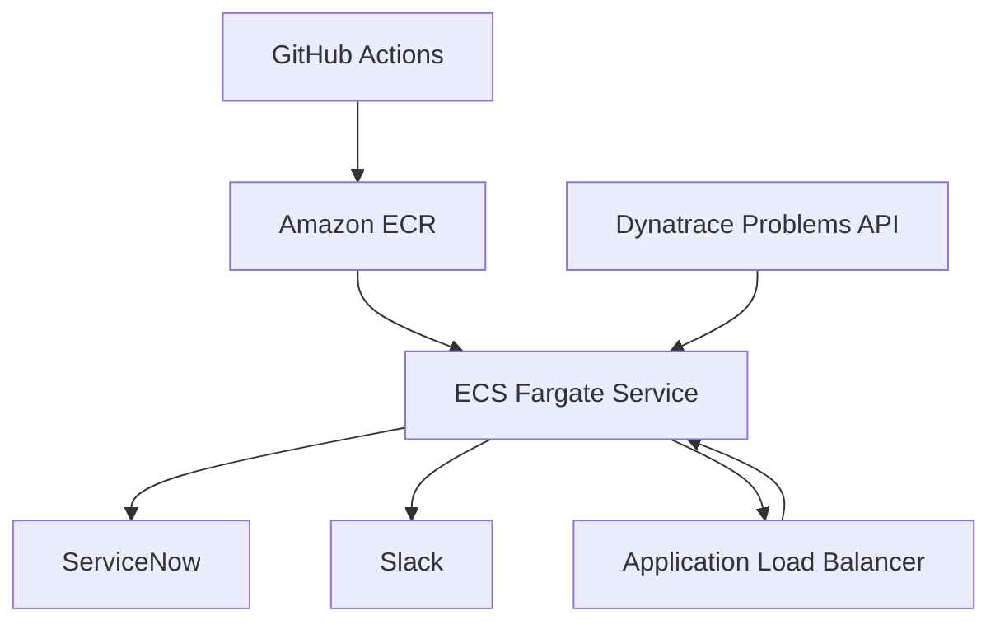

# AWS Container Deployment Architecture

## Overview

The AWS Dynatrace Incident Analyzer is deployed as a Docker container on AWS ECS Fargate.
Infrastructure is provisioned with Terraform and the container image is stored in Amazon ECR.
GitHub Actions builds the Docker image, pushes it to ECR, and forces ECS to deploy the latest version.

## Architecture Diagram

## Components

- **Dynatrace Problems API**: Provides incident data to the analyzer.
- **Docker container**: Runs the Python incident analyzer in a Linux container.
- **Amazon ECR**: Stores the container image.
- **AWS ECS Fargate**: Hosts the container without managing servers.
- **Application Load Balancer**: Routes HTTP traffic to the ECS service.
- **GitHub Actions**: Builds, pushes, and deploys the container.
- **ServiceNow**: Receives auto-created tickets.
- **Slack**: Receives human review notifications.

## Deployment Flow

1. GitHub Actions builds the Docker image and pushes it to ECR.
2. Terraform provisions the ECS cluster, service, ECR repository, ALB, and IAM roles.
3. The ECS service launches the container image.
4. GitHub Actions forces a new ECS deployment after the image push.
5. The app reads configuration from environment variables.

## Configuration

- **Terraform** manages all infrastructure resources.
- **ECR** stores the Docker image with mutable tags.
- **ECS Fargate** removes the need for server management.
- **GitHub Secrets** hold AWS creds and API keys.
- **App environment variables** pass Dynatrace, Claude, ServiceNow, and Slack settings.

## Monitoring

- Use **CloudWatch Logs** to inspect container logs.
- Use **ECS Service events** to track deployments.
- Use **ALB access logs** for HTTP traffic analysis.

## Deployment Steps

1. Configure AWS credentials locally.
2. Run `terraform init` and `terraform apply` in `infrastructure/`.
3. Build and push the container image.
4. Force ECS to deploy the updated task definition.

## Cost Considerations

- **Fargate** is billed per second, which is ideal for bursty incident processing.
- **ECR storage** costs are low for a single application image.
- **ALB** provides managed routing with predictable pricing.
- **Step Functions Express**: For high-volume workflows