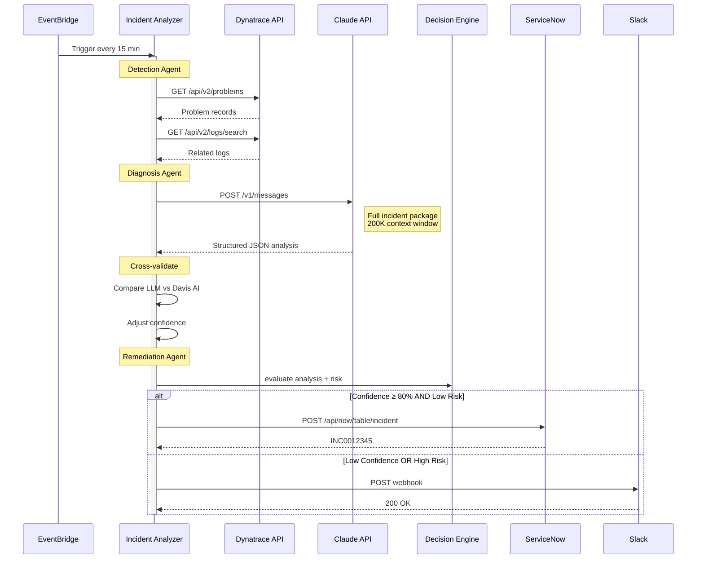

# AWS Incident Analyzer Architecture Sequence

This document describes the AWS incident analyzer workflow and the interaction between EventBridge, the application, Dynatrace, Claude, the decision engine, ServiceNow, and Slack.

## Notes

- EventBridge triggers the incident analyzer on a schedule.
- The app collects problem and log data from Dynatrace for diagnosis.
- Claude analyzes the incident package and returns structured JSON.
- The app cross-validates results with Dynatrace Davis AI before adjusting confidence.
- The decision engine evaluates risk and decides whether to create a ServiceNow incident or send a Slack alert.
